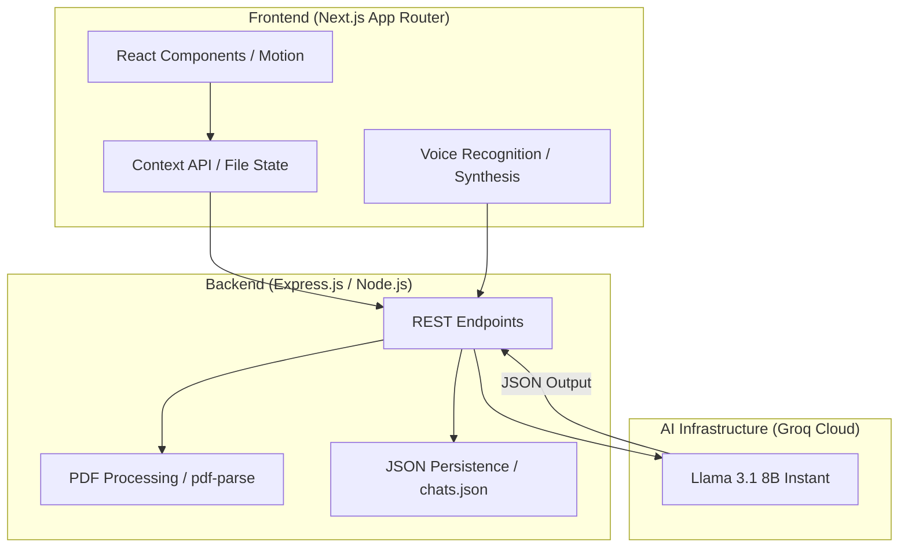

# 🏗️ AskMyNotes Architecture

AskMyNotes follows a modern **three-tier architecture** designed for high-performance AI interactions, rich visual storytelling, and seamless user experiences.

---

## 🗺️ System Overview



---

## 🎨 Frontend Architecture

The frontend is built for **Maximalist Aesthetics** and **Smooth Interactions**.

### **1. Visual Core**
- **Motion (formerly Framer Motion):** Powers all 3D book animations, portal-based dialogs, and the "Persona" AI element.
- **GSAP:** Used for complex scroll-triggered element scattering and layout transitions.
- **Doodle Elements:** Custom SVG-based handwritten doodles (stars, lightbulbs, pencils) are scattered throughout the UI to provide a playful "creative lab" atmosphere.

### **2. State Management**
- **Context API (`FileContext`):** Manages the "Active Note" across the landing page, chat room, and study modes.
- **Local Persistence:** Hydrates session data from the backend to ensure a seamless "return to where you left off" experience.

### **3. Interactive Intelligence**
- **Persona Component:** A custom animated AI avatar that changes its visual state (idle, thinking, listening, speaking) based on the application's processing status.
- **Web Speech API:** Real-time speech-to-text (STT) and text-to-speech (TTS) integration for the Voice Tutoring mode.

---

## ⚙️ Backend Architecture

The backend serves as a high-speed intelligence bridge.

### **1. Data Flow**
1. **Upload:** User uploads a PDF via a multi-form request (Multer).
2. **Extraction:** `pdf-parse` extracts raw text from the document.
3. **Analysis:** The text is sent to Groq's LPU™ Inference Engine where Llama 3.1 performs a "hierarchical distillation" into topics, subtopics, and summaries.
4. **Storage:** The result is indexed in `chats.json` for persistent retrieval.

### **2. AI Processing Layers**
- **RAG-lite (Retrieval Augmented Generation):** Instead of a heavy vector database, we use **Full-Context Distillation**. Since Llama 3.1 has a massive context window, we feed the entire extracted note into the model for high-fidelity responses without retrieval loss.
- **Structured JSON Output:** The backend strictly enforces JSON response formats from the LLM, ensuring the frontend always receives predictable data for citations and confidence bars.

---

## 🧪 Intelligence Engineering

We use specific prompting strategies to ensure academic rigor:

- **Verbatim Citations:** The AI is instructed to return direct quotes from the text for every key claim.
- **Scope Locking:** A strict system prompt prevents the AI from using external knowledge, ensuring answers are 100% grounded in the user's specific notes.
- **Underline Parsing:** The AI wraps key academic terms in `<u>` tags, which are then rendered as stylish indigo-underlined keywords in the UI.

---

## 📂 Project Structure

```text
Askmynotes/
├── frontend/             # Next.js Application
│   ├── src/
│   │   ├── app/          # App Router (Pages: home, chat, study, voice)
│   │   ├── components/   # UI System (Persona, Book Animation, Doodles)
│   │   └── context/      # Global State Management
├── backend/              # Node.js API Server
│   ├── src/
│   │   ├── controllers/  # Request Handlers
│   │   ├── services/     # AI Logic (Groq integration)
│   │   ├── routes/       # API Endpoint Definitions
│   │   └── uploads/      # Temporary PDF Storage
└── chats.json            # Flat-file persistence database
```
